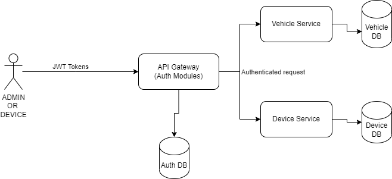

# Vehicle Tracking Sytem
### There are three services available .

- Authorization - Microservices handle all authentication and authorization needs for the applications.
- VehicleLocation - REST API's to capture cordinates,retrieve location etc.
- VehicleDiscovery - Eureka server as service registry
- Further details are available on projects  README file(except vehicleDiscovery) 
### POSTMAN
- A postman collection is also attached with details  
