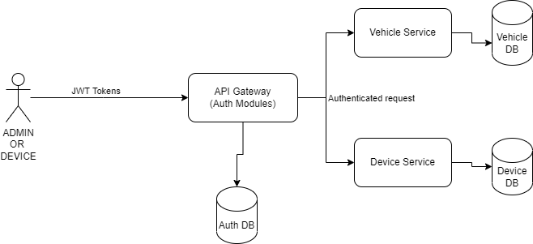

# Vehicle location service
### Oauth2 client credentails is used as authentication strategy.
### Assumptions
- There are two types of users in the application Device & Admin
- There will be a mapping between Device and Vehicle and its one to one. this mapping data will be available in Location DB.
- Microservices like vehicle,Device are behind the Zul proxy and its accessible only through Api gateway.

###### TECH STACK
- JDK 17
- Spring boot  
- Cassandra



## Configure Spring Datasource, JPA, App properties and update the below properties
Open `src/main/resources/application.properties` 
```
spring.data.cassandra.keyspace-name=changeit
spring.data.cassandra.contact-points=changeit
spring.data.cassandra.port=changeit

# Hibernate ddl auto (create, create-drop, validate, update)
spring.jpa.hibernate.ddl-auto= update
## Run Spring Boot application
```
mvn spring-boot:run
```

## Executing DML Scripts
Open `src/main/resources/db/migration/DDL-DMLScripts.sql` 
```
